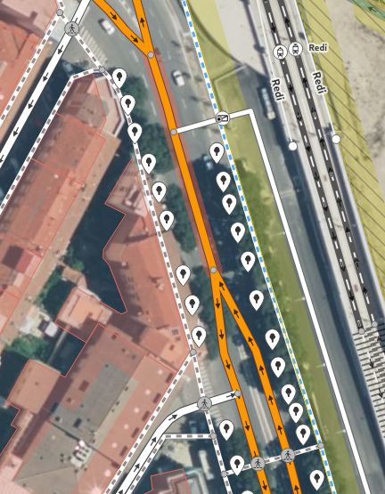
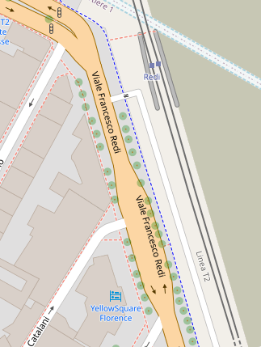
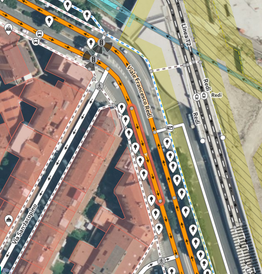

## Relazione per l’esame di Sistemi Distribuiti: Setup e manutenzione dell'ecosistema OpenStreetMap per la città di Firenze

### Introduzione

In questa relazione viene descritto tutto il lavoro svolto durante lo svolgimento del laboratorio.

Lo scopo è di inizializzare in locale una copia del sistema di OpenStreetMap compreso del suo editor iD per modificare le mappe e di un tile server per visualizzarle.

Il lavoro è stato svolto su una macchina virtuale con 2 core, 8 GB di memoria, 62 GB di spazio su disco e con sistema operativo Ubuntu Server.

### L'ecosistema OpenStreetMap

OpenStreetMap è composto da diversi software, ognuno dei quali fornisce degli strumenti o API per interfacciarsi ai dati OSM.
In questo documento ne vengono citati alcuni, solo quelli che sono stati necessari per avere un editor di mappe specifico per la mappa di Firenze.
Nel diagramma a blocchi riportato sotto viene riassunta sinteticamente la struttura dei software utilizzati.

Il sito web di [OpenStreetMap](https://www.openstreetmap.org) è il software principale per visualizzare le mappe ed effettuare le modifiche.
Tali modifiche si fanno con l'editor iD, tool già integrato nel sito ma che necessita di preconfigurazione.
Di default, sia l'editor che il sito scaricano le immagini (dette anche tile) da dei server ufficiali per la visualizzazione della mappa. Tuttavia si può configurare un Tile Server locale che renderizza la mappa con le proprie modifiche fatte in locale.

Tra gli strumenti disponibili nell'interfaccia di OpenStreetMap c'è anche il tool "Query features" indicato con l'icona . Questo strumento serve a ottenere dati OSM in una qualsiasi zona cliccata dal cursore. Per reperire velocemente questi dati il tool in questione utilizza un server provider di OverpassAPI.
Questa API è specializzata nel fare query in sola lettura sul database OSM in modo veloce ed efficiente.

### Setup

Per prima cosa è stato installato sulla macchina virtuale un clone del sito di OpenStreetMap con il tool grafico integrato “iD Editor”. È stato sufficiente seguire la guida su https://github.com/openstreetmap/openstreetmap-website/blob/master/DOCKER.md, che permette di installarlo in un container Docker tramite Docker-compose. Di seguito è raffigurato un diagramma di flusso che riassume tutti gli step seguiti per inizializzare il sito.

Per configurare il primo utente e per abilitare l'editor basta seguire la guida sotto:

Per questo caso d'uso è stata scaricata la mappa di Firenze in formato osm.pbf dal sito [https://extract.bbbike.org/](https://extract.bbbike.org/). Un’altra alternativa è il sito [HotExport](https://export.hotosm.org/en/v3/), ma le mappe esportate sono prive di alcuni metadati tra cui le timestamps necessarie per impostare gli aggiornamenti automatici qualora saranno necessari.

La mappa selezionata è approssimativa, cioè contiene tutti i dati di Firenze ma anche dati parziali di comuni vicini. Questo perché i tool menzionati scaricano i dati selezionati da una boundingbox. Per query più elaborate si potrebbe provare a usare il tool [OverpassTurbo](https://overpass-turbo.eu/) [1](https://help.openstreetmap.org/questions/80335/find-cities-boundary-in-a-specific-country).

Occasionalmente durante la fase di import del file osm.pbf si riscontravano errori del tipo `duplicate key value violates unique constraint`. In questi casi è stato sufficiente eseguire i seguenti comandi che difatto resettano i database:

- `docker-compose run --rm web bundle exec rails db:reset`

- `docker-compose run --rm web bundle exec rails db:migrate` 

Una volta ingerito il file pbf, viene avviato il container per completare la configurazione dell’editor, i cui step sono mostrati nel documento [CONFIGURE.md](https://github.com/openstreetmap/openstreetmap-website/blob/master/CONFIGURE.md) della repository.  
Tutta questa procedura di setup è racchiusa nello script `osm-website-setup.sh`, eccezion fatta per la registrazione e configurazione manuale dell'utente di iD.
Lo script `open-rails-console.sh` è un alias del comando (troppo verboso) `docker-compose run --rm web bundle exec rails console` che apre la console del database.

### Primi test – cancellazione di entità

Come primo test si è provato a cancellare degli edifici antistanti alla facoltà di Ingegneria a Santa Marta (in particolare gli edifici [#110964127](https://www.openstreetmap.org/way/110964127) e [#110964128](https://www.openstreetmap.org/way/110964128)).

Osservando il changeset si nota subito che gli edifici sono delle entità di tipo “Way” con tag `building=yes` a cui sono associati dei _nodes_ che delimitano la forma dell’area occupata.

Se si visualizza l’area in modalità edit, gli edifici di fatto sono scomparsi e non più modificabili, ma se si ritorna in modalità di visualizzazione classica o se si imposta la mappa “OpenStreetMap (Standard)” sullo sfondo, gli edifici appena cancellati sono ancora visualizzabili.

Questo è dovuto al fatto che lo sfondo è un’immagine renderizzata dai dati di OSM. Perciò per avere una mappa aggiornata è necessario renderizzare nuovamente la cella (vedi OSM Tile Server).

Ritornando in modalità di visualizzazione, puntando il tool “Query features” sulla zona interessata, gli edifici sono ancora identificabili. Però se si va a cliccare su uno di essi nel menù a sinistra, viene mostrato che tale entità è stata cancellata in un changeset.

Ciò si riflette nello schema database di OSM, in quanto nella tabella “current_ways” la riga con id 110964128 è ancora presente ma è stata aggiornata con l’ultimo changeset e marcata “invisibile”. Mentre nella tabella “ways” ci sono più righe con quel ID, ciascuna per ogni versione di quella entità. La tabella “ways” praticamente tiene conto della storia delle varie entità[2](https://help.openstreetmap.org/questions/62670/way_nodes-and-current_way_nodes).

### Creazione nuova entità

Successivamente alla cancellazione degli edifici, si è provato a aggiungere un eliporto, composto da un “Helipad” e una “Service Road” di accesso.  
Dopo aver inviato il changeset, come nel caso precedente i cambiamenti non si riflettono immediatamente sulla mappa.

Tuttavia la cosa che ci si aspettava è che in modalità view il tool “Query features” riuscisse a trovare le due entità appena create. Ciò non è avvenuto.

Per accedere alle informazioni delle entità è stato necessario manipolare l’URL manualmente, inserendo nella barra degli indirizzi `http://<host>:<port>/way/<id>` che nel setup in questione è `http://localhost:3000/way/1`. Ottenere l’id delle entità non è stato immediato, infatti è stato necessario navigare nel profilo dell’utente sotto la sezione “My Edits”.

Questo succede perché il tool in questione utilizza [OverpassAPI](https://wiki.openstreetmap.org/wiki/Overpass_API) che fa uso di dati mirror di OSM [3](https://wiki.openstreetmap.org/wiki/Query_features_tool).

Il sito locale di OSM comunque permette di cambiare il provider di questo servizio. È sufficiente cambiare l’URL in `/config/settings.yml` alla voce ‘overpass_url’. Quindi è possibile configurare un server di Overpass in locale e agganciarlo al sito [4](https://dev.overpass-api.de/overpass-doc/en/more_info/setup.html).

### Database schema

Lo schema che descrive la struttura del database di OpenStreetMap lo si può trovare a questo [link](https://wiki.openstreetmap.org/wiki/Openstreetmap-website/Database_schema).

La parte che è più di interesse è quella relativa ai “nodes”, “ways”, “relations” e “changesets”.

Le informazioni dei nodi sono salvate nelle tabelle “current_nodes”, “current_node_tags”, “nodes” e “node_tags”. Le prime due salvano i dati che costituiscono il nodo e i suoi tag, le altre due salvano gli stessi dati ma per ogni versione, difatto memorizzando tutta la storia dei nodi.

Le strade vengono memorizzate nelle tabelle “ways”, “current_ways”, “way_nodes”, “current_way_nodes”, “way_tags” e “current_way_tags”. Identicamente ai nodi, le tabelle “current” salvano solo i dati delle strade effettivamente visualizzate, mentre le tabelle non “current” salvano tutta la storia di ogni strada.

Lo stesso si può dire per le relazioni, che sono memorizzate nelle tabelle “relations”, “relation_tags”, “relation_members” e le loro versioni “current”.

I changesets invece sono memorizzati nelle tabelle “changesets” e “changeset_tags” con altre due tabelle accessorie “changeset_comments” e “changesets_subscribers”.

Le modifiche fatte con l’editor iD finiscono sia nella tabella “current” che nella tabella non “current”, dove in quest’ultima c’è la colonna “changeset_id” che indica in quale changeset è stata fatta la modifica.

### OSM Tile Server

Per renderizzare le nuove tile c’è bisogno di un tile server. Tra le varie alternative è stato scelto di fare un [fork](https://github.com/SimoMett/openstreetmap-tile-server) di [openstreetmap-tile-server di Overv](https://github.com/Overv/openstreetmap-tile-server), che è la soluzione al momento più facile da mettere in piedi.  
Lo script `osm-tile-server-setup.sh` clona e configura il server come descritto nei seguenti passaggi:

- Clonare la [repository](https://github.com/SimoMett/openstreetmap-tile-server) ed eseguire il comando `docker-compose build`.
    
- Seguire i passi del Readme.md della repository, incluso la creazione del volume ‘osm-tiles’ usato per la cache delle tile già renderizzate.
    
- Una volta messo in piedi il container, Creare la cartella `osm-updates`.

- Importare un file pbf con il comando `./import-pbf.sh /path/to/file.osm.pbf` specificando il percorso COMPLETO.
  
Di default il sito web di OSM utilizza le proprie tile per la modalità visualizzazione e per l'editor iD. Per utilizzare le nostre tile bisogna:
1. Modificare la linea 17 di `openstreetmap-website/vendor/assets/leaflet/leaflet.osm.js` con `url: 'http://<host>:<port>/tile/{z}/{x}/{y}.png',` specificando l'ip e la porta del tile server [5](https://help.openstreetmap.org/questions/73488/change-tiles-of-local-openstreetmap-website).
2. Entrare nell'editor iD, cliccare a destra su "Background Settings", cambiare il background a custom e inserire il medesimo URL di prima, ovvero `http://<host>:<port>/tile/{z}/{x}/{y}.png`.
    
#### Aggiornamento delle tile
L’aggiornamento delle tile non è un’azione di norma immediata. Al momento è stata individuata una procedura per aggiornare il database e le tile che sfrutta il programma _osm2pgsql_ incluso nel container.  Lo script `launch-update-task.sh` automatizza questa operazione effettuando i seguenti step che possono essere svolti manualmente: 

-   Montare una cartella esterna su `/data/updates` o altro percorso a scelta.  
    Siccome si usa docker-compose, è bastato aggiungere la riga `-./osm-updates:/data/updates` sotto la riga `- osm-tiles:/data/tiles/`
    
-   Spostare il file dei diffs in questa cartella, che in questo caso è `osm-updates`  
    Nota bene: il file deve essere in formato .osc, compresso o in chiaro, ma per ridurre le dimensioni è stato deciso di comprimerlo in formato .osc.gz.  
    Di seguito viene spiegata la procedura per generare questo file.
    
-   Lanciare il comando `docker exec -it <container-id> bash autoimport-updates.sh updates.osc.gz` per avviare la procedura.  
    Questo è uno script che è stato scritto per automatizzare la procedura di importazione degli aggiornamenti e scadenza delle tile.

Con _osmosis_ la procedura per generare i diffs tra due file pbf è la seguente:

-   `osmosis --read-pbf “file1.osm.pbf” --read-pbf “file2.osm.pbf” --derive-change --write-xml-change “updates.osc.gz”`.  
    Questo comando prende in input due file pbf, trova le differenze e le salva in un file formato .osc.gz .  Lo script `export-diffs.sh` riassume questo comando, basta invocarlo con i nomi dei tre file, per esempio `./export-diffs.sh file1.osm.pbf file2.osm.pbf updates.osc.gz`.

L'intera operazione impiega una decina di secondi per changesets piccoli. Non è stato ancora testato per changesets grandi.

Le modifiche sulle tile in teoria si dovrebbero riflettere immediatamente, però nella pratica la cache del browser interferisce con la richiesta di renderizzare le nuove tile appena modificate.

#### Si può fare di meglio

La procedura di aggiornamento delle tile appena proposta funziona bene, però è molto macchinosa e non granulare, nel senso che non è possibile per esempio ottenere le modifiche fatte in un certo changeset oppure ottenere le modifiche fatte in un certo lasso di tempo. L'unica cosa che permette di fare è prendere tutte le modifiche effettuate fino al momento dell'avvio dell'aggiornamento, estraendo tutto il database in un file e comparando le due versioni con Osmosis. Sicuramente è un grosso miglioramento rispetto al dover resettare tutto il container ogni qualvolta che si vuole rirenderizzare le tile, però si può fare di meglio.

La documentazione di Osmosis su https://wiki.openstreetmap.org/wiki/Osmosis/Detailed_Usage cita diverse funzionalità interessanti, come `--read-apidb-change (--rdc)` e tutta l'integrazione con PostGis. Infatti il task `--read-apidb-change` è un modo più diretto e più configurabile per ottenere i changesets. Lo script `get-updates-by-time.sh` implementa questa funzionalità: estrae i changesets effettuati in un intervallo di tempo. Basta eseguire il comando con la seguente sintassi: `./get-updates-by-time.sh [data in formato yyyy-MM-dd_HH:mm:ss]` per ottenere i changesets da una certa data in poi, oppure `./get-updates-by-time.sh [inizio intervallo in yyyy-MM-dd_HH:mm:ss] [fine intervallo in yyyy-MM-dd_HH:mm:ss]`.

#### Task periodico
Lo script `update-tiles-periodic-task.sh` può essere invocato periodicamente con programmi tipo Crontab per schedulare updates periodici.

### Overpass API

Nella sezione “Creazione nuove entità” si è evidenziata l’importanza di inizializzare un proprio provider di Overpass per accedere alle modifiche effettuate in locale.

Di seguito sono illustrati gli step per inizializzare tale componente:

-   Nonostante ci siano diverse alternative per creare un’istanza, è stato scelto il seguente container docker per la sua semplicità: [https://github.com/wiktorn/Overpass-API](https://github.com/wiktorn/Overpass-API).  
    Dunque, clonare con git questa repository.
    
-   Entrare nella cartella Overpass-API e creare la cartella “overpass-db”.
    
-   Copiare il file osm.bz2 della mappa in questa cartella.  
    Si può ottenere il file osm.bz2 in due modi:
    

1.  esportando il file osm.bz2 con osmosis dall’editor con il comando `docker-compose run --rm web osmosis --read-apidb host="db" database="openstreetmap" user="openstreetmap" validateSchemaVersion="no" --write-xml "Firenze.osm.bz2"`
    
2.  convertendo il file osm.pbf in osm.bz2 usando osmosis fuori dal container con il comando `osmosis --read-pbf “Firenze.osm.pbf” --write-xml “Firenze.osm.bz2”`.
    

-   Modificare il file docker-compose.yml come descritto:
    
    - Riga 13: ` - 80:80` (facoltativo, ma per praticità è stata impostata la porta esterna a quella di default del protocollo HTTP)
    
    - Riga 16: ` - ./overpass-db:/db `
    
    - Riga 18: ` - OVERPASS_META=yes`
    
    - Riga 20: ` - OVERPASS_PLANET_URL=file:///db/Firenze.osm.bz2`

    - Commentare riga 21
    
    - Commentare righe 24, 25 e 26
    
-   Nella cartella dell’editor modificare il file `config/settings.yml` alla voce “overpass_url” e inserire il link su dove viene esposta l’API, che di default è `http://localhost/api/interpreter`.
    
    Nota bene: se si opera su una macchina virtuale, come in questo caso, l’URL da inserire è `http://localhost:8088/api/interpreter` poiché la porta 80 interna della macchina è stata mappata sulla porta esterna 8088. Se si imposta l’url di default l’editor non riesce ad accedervi, ma se si espone tramite port-forwarding la porta 80 su la 8088 (o altra a propria scelta) allora l’editor riesce a comunicare. Da ciò si può dedurre che non è l’editor iD a interrogare l’API bensì l’editor delega il client dell’utente a effettuare la query.
    
-   Riavviare il container dell’editor se era in esecuzione.
    
-   Tornare nella cartella di Overpass-API e avviare il container con `docker-compose up -d`.  
    Nella prima esecuzione viene creato il database nella sottocartella “overpass-db”, dopodichè terminerà. Quindi avviare nuovamente il container con docker-compose.

A questo punto se tutto è andato bene dovrebbe essere possibile visualizzare le nuove entità con il tool “Query features”.

### Altri test – divisione delle corsie di Viale Redi, Viale Alderotti, Piazza Dalmazia e Via di Santa Marta

I test successivi sono stati la separazione delle carreggiate a doppio senso di marcia in strade parallele a senso unico, con l’intento di vedere come si sarebbe comportato il tile server a renderizzare le strade e soprattutto se si fossero presentati artefatti indesiderati.

Si è iniziato con Viale Francesco Redi. La modifica è stata semplice da realizzare, in quanto i due sensi di marcia sono ben separati da doppia linea continua e non è possibile effettuare inversioni di marcia o svoltare in altre strade a sinistra, cosa che implicherebbe creare ulteriori intersezioni.

Di seguito viene mostrato il viale prima e dopo la modifica.

  |  
:-------------------------:|:-------------------------:
_Figura 1: Viale Redi dall'editor iD_ | _Figura 2: Viale Redi renderizzato prima delle modifiche_

  |  
:-------------------------:|:-------------------------:
_Figura 3: Viale Redi dall'editor iD dopo le modifiche_ | _Figura 4: Viale Redi renderizzato dopo le modifiche_

Si potrebbe quasi proporre come modifica ufficiale su OpenStreetMaps.

Successivamente si è modificato il tratto di Viale Alderotti che interseca Via Borghi e le strade di accesso ai parcheggi di Careggi.

|
:-------------------------:|:-------------------------:
_Figura 5: Viale Alderotti dall'editor iD_ | _Figura 6: Viale Alderotti renderizzato prima delle modifiche_

|
:-------------------------:|:-------------------------:
_Figura 7: Viale Alderotti dall'editor iD dopo le modifiche_ | _Figura 8: Viale Alderotti renderizzato dopo le modifiche_

Anche in questo caso il tile renderer non ha generato anomalie, tuttavia con questa modifica si sono formate involontariamente due rotatorie consecutive. Ciò potrebbe essere una sezione critica nel caso in cui si voglia farvi eseguire un Graphhopper. Una soluzione può essere applicare delle restrizioni sulle svolte che si possono prendere.
Tali restrizioni si possono applicare con il tool di iD mostrato in figura 13.

Qui si è voluto provare a fare un test un po’ più alternativo: prendere le strade con più di una corsia che confluiscono in Piazza Dalmazia (nodo critico per la viabilità di Firenze) e dividerle in più strade a corsia unica.

|
:-------------------------:|:-------------------------:
_Figura 9: Piazza Dalmazia dall'editor iD_ | _Figura 10: Piazza Dalmazia renderizzato prima delle modifiche_

|
:-------------------------:|:-------------------------:
_Figura 11: Piazza Dalmazia dall'editor iD dopo le modifiche_ | _Figura 12: Piazza Dalmazia renderizzato dopo le modifiche_

In questo esempio, oltre alla stessa criticità presente nel caso di Viale Alderotti (risolvibile sempre con il tool della figura 13), si ha anche il problema di sdoppiare altre entità come semafori, attraversamenti pedonali e intersezioni con i binari della tramvia.

|
:-------------------------:|:-------------------------: 
_Figura 13: Tool per modificare la viabilità_ | _Figura 14: Criticità doppio semaforo_

L’ultimo test è stato quello più problematico.

È stato sdoppiato il senso di marcia in un tratto di Via di Santa Marta, e sono state riscontrate delle anomalie. La più importante è stata che nel tratto rappresentato sotto in figura la strada e la forma disegnata non coincidono.

_Figura 15: Anomalia Via di Santa Marta_

È possibile che questo sia dovuto alla presenza di troppi "building" nelle vicinanze e poco spazio a sufficienza che impedisce la corretta formazione della curva.

### Fare revert di un changeset

Il revert delle modifiche non è un operazione immediata come potrebbe essere per esempio con i commit su Git. Queste sono alcune fonti che parlano di ciò:

- [https://wiki.openstreetmap.org/wiki/Change_rollback](https://wiki.openstreetmap.org/wiki/Change_rollback)
- [https://wiki.openstreetmap.org/wiki/Osm-revert](https://wiki.openstreetmap.org/wiki/Osm-revert)

In ogni caso, se si sbaglia a fare delle modifiche bisogna annullarle manualmente o eseguire uno dei tanti script per il revert delle modifiche. Quindi bisogna stare attenti alle modifiche che si vuole apportare. Una volta inviate i changesets questi vengono applicati subito sul database, senza alcun processo di approvazione da parte degli amministratori.

### Altre fonti

1. https://help.openstreetmap.org/questions/80335/find-cities-boundary-in-a-specific-country  
2. https://help.openstreetmap.org/questions/62670/way_nodes-and-current_way_nodes  
3. https://wiki.openstreetmap.org/wiki/Query_features_tool  
4. https://dev.overpass-api.de/overpass-doc/en/more_info/setup.html  
5. https://help.openstreetmap.org/questions/73488/change-tiles-of-local-openstreetmap-website  
